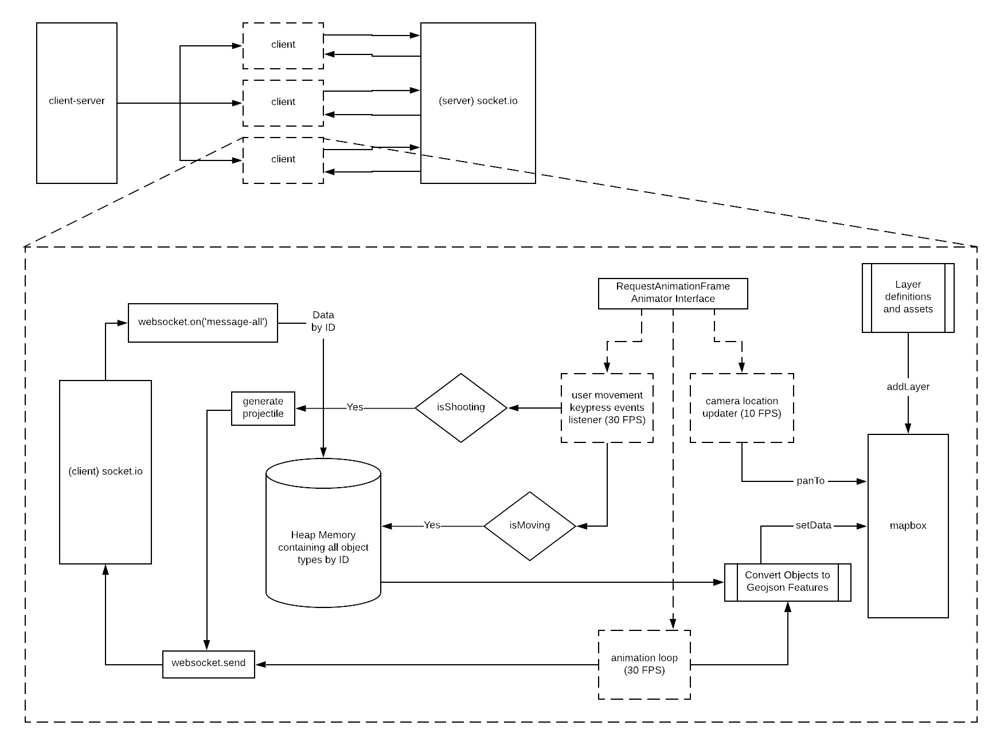
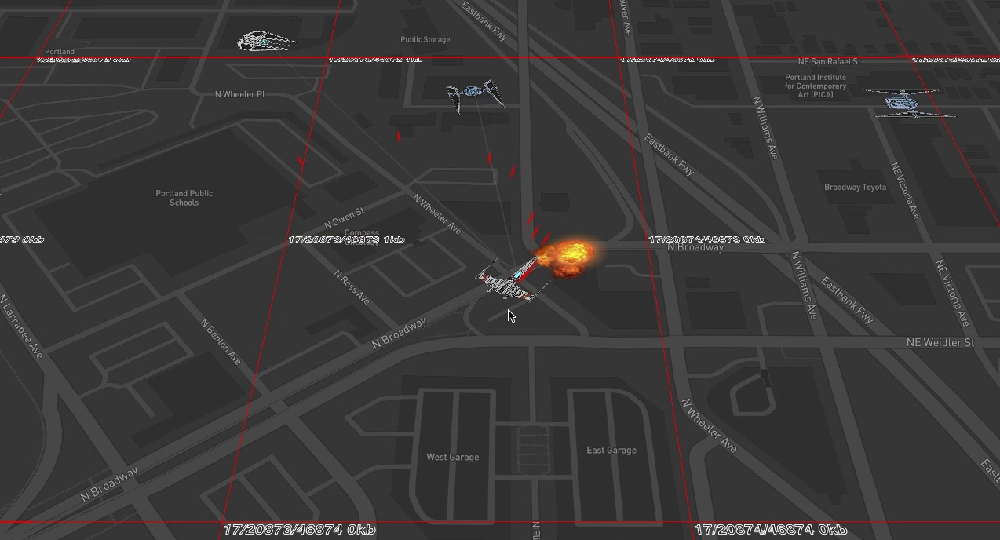
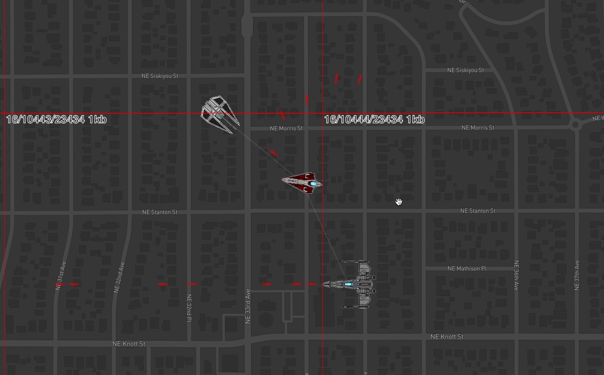

# The Flock
A multi player/user app/game that connects through a (socket.io) websocket server [the-flock-network](https://github.com/yapalexei/the-flock-network) showing fake flyers on a map.

A demo can be viewed here with a mapbox Death5tar style theme: [the flock demo](http://flock.claypot.io/). Fighter craft credits go to [kavinveldar](https://www.deviantart.com/kavinveldar/gallery).

## Prerequisites
- node version: 12.12.0
- npm version: 6.11.3
- Be sure to have [the-flock-network](https://github.com/yapalexei/the-flock-network) running on port 3001.
- Before you can run this example update the `MAPBOX_ACCESS_TOKEN` inside the `.env.defaults` file to a valid mapbox-gl token. Or add it to `.env` file to override it.
- (optional) Docker

## Setup and run steps
- `yarn`
- `yarn start`
- OR (optionally) `yarn docker`

## Game Controls
- The arrow keys.
- space bar to fire
- "t" for 2x speed.

## General Component/Flow Diagram

preview of game play

